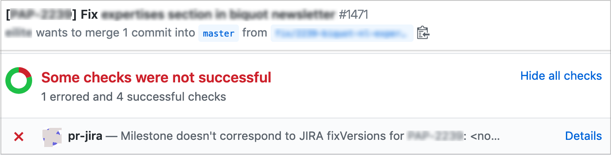

# pr-jira

> A GitHub App built with [Probot](https://github.com/probot/probot) that Probot app that check consistency between pull requests and JIRA issues

## Usage

Just [configure](#configuration) with JIRA integration and have the right pull request naming.

> TODO



### GitHub Actions

To use this bot with [GitHub Actions](https://github.com/features/actions), the following workflow can be defined as `.github/workflows/jira.yml` in your repository.

```
name: JIRA consistency

on: 
  installation:
    types: ['created', 'deleted']
  issues:
    types: ['milestoned', 'demilestoned']
  pull_request:
    types: ['opened', 'edited', 'synchronize', 'reopened', 'closed']
  schedule:
    - cron: '5 * * * *'

inputs:
  'jira domain':
    description: 'JIRA domain (e.g. foo.atlassian.net)'
    required: true
  'jira user':
    description: 'User name that this application impersonates when accessing JIRA (with the `JIRA_API_TOKEN` as password)'
    required: true
  'jira api token':
    description: 'JIRA API token; See https://confluence.atlassian.com/cloud/api-tokens-938839638.html'
    required: true
  'jira project name':
    description: 'JIRA project name (generally a 3 uppercase key)'
    required: true

jobs:
  jira_pr:
    runs-on: ubuntu-latest
    steps:
      - uses: cchantep/probot-jira@ghaction-1.0.x
        env:
          GITHUB_TOKEN: ${{ secrets.GITHUB_TOKEN }}
```

### Configuration

The following environment are required (and provided as inputs when this configured as [GitHub workflow](#github-actions).

- `INPUT_JIRA_DOMAIN`: Your JIRA domain (e.g. foo.atlassian.net)
- `INPUT_JIRA_USER`: User name that this application impersonates when accessing JIRA (with the following `JIRA_API_TOKEN` as password).
- `INPUT_JIRA_API_TOKEN`: *See [Atlassian Cloud Support](https://confluence.atlassian.com/cloud/api-tokens-938839638.html)*
- `INPUT_JIRA_PROJECT_NAME`: The JIRA project name (generally a 3 uppercase key).

If deployed as a shared instance, to define the JIRA settings per GitHub repository, replace the `INPUT_` prefix with owner and repository name: e.g. `MYUSER_MYREPO_JIRA_DOMAIN`.

On each repository for which the application is installed,
a file named [`pr-jira.json`](./src/resources/pr-jira.json) can be defined on the base branches, in a `.github` directory at root. Default:

```json
{
  "issueKeyRegex": "^\\[([^\\[^\\]]+)\\].*$",
  "fixVersionRegex": "^(.+)$",
  "postMergeStatus": [ "Done" ]
}
```

- `issueKeyRegex`: Regular expression to check whether the title of pull request matches a JIRA issue. One capture group is expected, to extract the issue key from corresponding pull request.
- `fixVersionRegex`: Regular expression to capture (with the first group) the milestone from a JIRA fix version.
- `postMergeStatus`: One or more JIRA status names (as displayed in the JIRA UI), that are expected for an JIRA issue corresponding to a merged pull request.

## Build

```sh
# Install dependencies
npm install

# Run typescript
npm run build

# Run the bot
npm start
```

## Contributing

If you have suggestions for how pr-jira could be improved, or want to report a bug, open an issue! We'd love all and any contributions.

For more, check out the [Contributing Guide](CONTRIBUTING.md).

## License

[ISC](LICENSE) © 2019 [Cédric Chantepie](https://github.org/cchantep)
