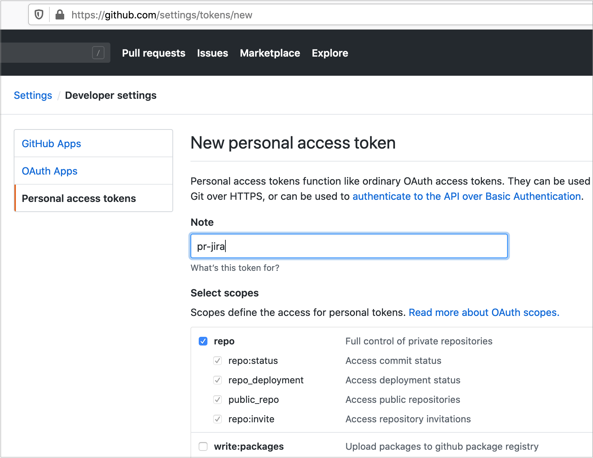

# pr-jira

> A GitHub App built with [Probot](https://github.com/probot/probot) that Probot app that check consistency between pull requests and JIRA issues

## Usage

For each pull request matching a JIRA issue (see [`issueKeyRegex`](#developer-configuration), the consistency is checked (GitHub milestone corresponds to [JIRA issue fix version](https://www.atlassian.com/agile/tutorials/versions)).

When a JIRA related pull request is merged, this app warns the author if the JIRA issue is not updated (see [`postMergeStatus`](#developer-configuration)).


### GitHub Actions

To use this bot with [GitHub Actions](https://github.com/features/actions), the following workflow can be defined as `.github/workflows/jira.yml` in your repository.

```
name: JIRA consistency

on: 
  issues:
    types: ['milestoned', 'demilestoned']
  pull_request:
    types: ['opened', 'edited', 'synchronize', 'reopened', 'closed']
  schedule:
    - cron: '5 * * * *'

jobs:
  jira_pr:
    runs-on: ubuntu-latest
    steps:
      - uses: cchantep/probot-jira@ghaction-1.0.x
        env:
          GITHUB_TOKEN: ${{ secrets.GITHUB_TOKEN }}
          PERSONAL_TOKEN_VALUE: 'personal_token'
          PERSONAL_TOKEN_USER: 'username_of_personal_token'
          JIRA_API_TOKEN: ${{ secrets.JIRA_API_TOKEN }}
          JIRA_DOMAIN: 'my.domain.tld'
          JIRA_USER: 'my-jira-login@foo.bar'
          JIRA_PROJECT_NAME: 'PRJ'
```

*GitHub action limitations:* Has there is no specific process to uninstall an action, this app is not able to remove its JIRA hooks when no longer used in a GitHub workflow (have to remove manually the JIRA hook with a name of form `github-pr-jira*`).

### Global configuration

The required `JIRA_API_TOKEN` must be defined in the [repository secrets](https://help.github.com/en/articles/virtual-environments-for-github-actions#creating-and-using-secrets-encrypted-variables) (see [Atlassian Cloud Support](https://confluence.atlassian.com/cloud/api-tokens-938839638.html)).
This token must be allowed to read and write hooks using the JIRA REST API, and to read issue for the configured projects.

To complete the JIRA integration, the following environment variables are required.

- `JIRA_DOMAIN`: Your JIRA domain (e.g. foo.atlassian.net)
- `JIRA_USER`: User name that this application impersonates when accessing JIRA (with the following `JIRA_API_TOKEN` as password).
- `JIRA_PROJECT_NAME`: The JIRA project name (generally a 3 uppercase key).

- `PERSONAL_TOKEN_VALUE`: A [personal token](https://help.github.com/en/articles/creating-a-personal-access-token-for-the-command-line) created for a GitHub user having access to the repository ([`repo` scope](https://developer.github.com/apps/building-oauth-apps/understanding-scopes-for-oauth-apps/#available-scopes)).
- `PERSONAL_TOKEN_USER`: The name of the user for which the `PERSONAL_TOKEN_VALUE` is defined.



> When this is configured as [GitHub workflow](#github-actions), the previous settings can be defined as input (set in environment with `INPUT_` prefix).

If deployed as a shared instance, to define the JIRA settings per GitHub repository, add a uppercase prefix with owner and repository name: e.g. `MYUSER_MYREPO_JIRA_DOMAIN`.

### Developer configuration

On each repository for which the application is installed, a file named [`.github/pr-jira.json`](./src/resources/pr-jira.json) can be defined (defaults thereafter).

```json
{
  "issueKeyRegex": "^\\[([^\\[^\\]]+)\\].*$",
  "fixVersionRegex": "^(.+)$",
  "postMergeStatus": [ "Done" ]
}
```

- `issueKeyRegex`: Regular expression to check whether the title of pull request matches a JIRA issue. One capture group is expected, to extract the issue key from corresponding pull request.
- `fixVersionRegex`: Regular expression to capture (with the first group) the milestone from a JIRA fix version.
- `postMergeStatus`: One or more JIRA status names (as displayed in the JIRA UI), that are expected for an JIRA issue corresponding to a merged pull request.

This configuration is considered per each base branch. 

## Build

```sh
# Install dependencies
npm install

# Run typescript
npm run build

# Run the tests
npm run test

# Run the bot
npm start
```

[](https://circleci.com/gh/cchantep/probot-jira)

## Contributing

If you have suggestions for how pr-jira could be improved, or want to report a bug, open an issue! We'd love all and any contributions.

For more, check out the [Contributing Guide](CONTRIBUTING.md).

## License

[ISC](LICENSE) © 2019 [Cédric Chantepie](https://github.org/cchantep)
